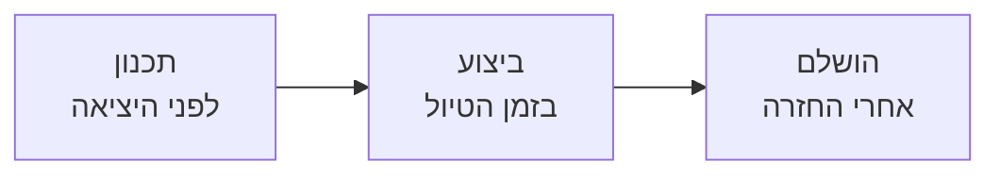
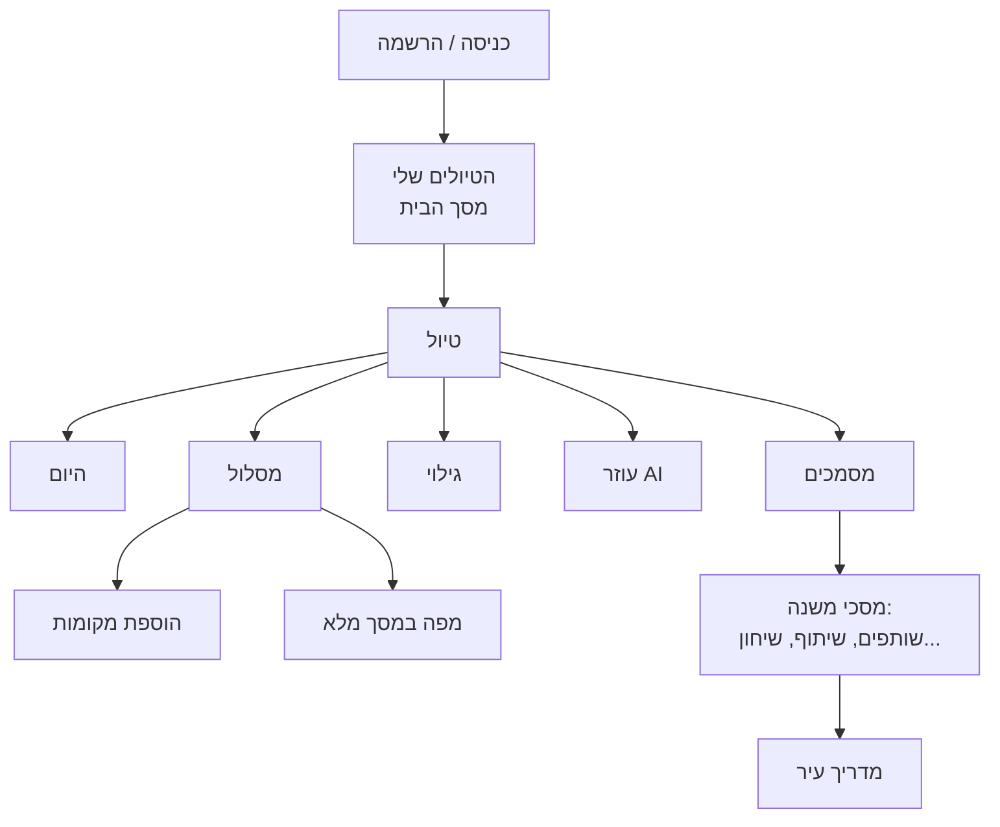

# MyTrip — בריף למעצב

2026-09-24

MyTrip היא אפליקציית ווב בעברית שמלווה טיול מהרעיון ועד החזרה הביתה: תכנון, לו״ז יומי בשטח, וכל המסמכים במקום אחד. המסמך מתאר את המטרה, העמודים והיכולות, כדי שאפשר יהיה לעצב אותה מקצה לקצה.

## מה האפליקציה ולמי היא מיועדת

האפליקציה פותרת בעיה אחת: המידע על טיול מפוזר בין הרבה מקומות. יש פתק עם רשימת מקומות, מיילים עם אישורי טיסה ומלון, קבוצת וואטסאפ עם המלצות, מפה בנפרד ותחזית בנפרד. MyTrip מרכזת את כל אלה בטיול אחד.

**קהל היעד:** מטיילים עצמאיים, זוגות, משפחות וקבוצות חברים שמתכננים בעצמם טיול לחו״ל של כמה ימים עד כמה שבועות, לרוב במסלול של כמה ערים.

**ההבטחה למשתמש:** פחות זמן על ארגון וחיפושים, ויותר זמן בטיול עצמו.

**שלושה דברים שהאפליקציה עושה:**

1. **עוזרת לתכנן:** בוחרים ערים ותאריכים, מוצאים מקומות ומקבלים הצעות מעוזר חכם (AI).
2. **מסדרת לו״ז:** מה עושים בכל יום ובאיזה סדר, כולל טיסות ולינות.
3. **מלווה בשטח:** בזמן הטיול היא מראה מה עכשיו ומה אחר כך, מזג אוויר, הוצאות, מילים בשפה המקומית ועוד.

הממשק כולו בעברית (מימין לשמאל), והשימוש העיקרי הוא בנייד, בדרכים.

## מחזור החיים של טיול

כל טיול עובר שלושה מצבים, והממשק צריך להרגיש אחרת בכל אחד מהם.

| מצב | מה המשתמש צריך | אופי המסך |
| --- | --- | --- |
| **תכנון** | לבחור ערים, למצוא מקומות, לבנות ימים, להכין ציוד ולסגור הזמנות | סביבת עבודה: חיפוש, הצעות, רשימות, מפה |
| **ביצוע** | לדעת מה עכשיו ומה הבא, איך מגיעים, מה מזג האוויר, כמה הוצאנו | מלווה שקט: כרטיס ״עכשיו״, מידע קצר, גישה מהירה |
| **הושלם** | לחזור ולראות מה היה | תיעוד: הלו״ז כפי שהיה |

הלשונית **״היום״** קיימת רק בזמן הטיול. לפני שהוא מתחיל היא מוצגת מושבתת וקטנה, כדי שהמשתמש יבין שהיא תיפתח כשהטיול יתחיל. טיול תמיד נפתח על לשונית **״מסלול״**, כי בכל שלב המסלול הוא העיקר: לפני הטיול בונים אותו, בזמן הטיול עוקבים אחריו, ואחריו הוא התיעוד של מה שהיה.

## מפת העמודים

באפליקציה יש כ-20 מסכים שהמשתמש רואה, בשלושה אזורים: כניסה וחשבון, מסך הבית של כל הטיולים, ומרחב העבודה של טיול אחד.

בתוך טיול יש חמש לשוניות. בטלפון הן בסרגל תחתון, ובמחשב בר׳יל אנכי צר בצד. טיול נפתח תמיד על ״מסלול״.

| אזור | מסך | מטרה במשפט |
| --- | --- | --- |
| כניסה | התחברות, הרשמה, איפוס סיסמה, סיסמה חדשה | כניסה במייל וסיסמה או ב-Google |
| כניסה | מדיניות פרטיות | מה נשמר על המשתמש ומה לא |
| כניסה | הזמנה לטיול | דף שמגיעים אליו מקישור הזמנה ומצטרפים לטיול |
| ציבורי | צפייה בטיול משותף | עמוד קריאה בלבד למשפחה וחברים, בלי חשבון |
| בית | **הטיולים שלי** | כל הטיולים, מפת עולם, יצירת טיול חדש |
| טיול (לשונית) | **היום** | מלווה היום בזמן הטיול: מה עכשיו, איפה ישנים, כלים מהירים |
| טיול (לשונית) | **מסלול** | הלו״ז יום אחרי יום. המסך הראשי של טיול |
| טיול (לשונית) | **גילוי** | חפיסת מקומות בסגנון סוויפ: ימינה שומר, שמאלה מדלג |
| טיול (לשונית) | **עוזר AI** | שיחה עם עוזר חכם שיכול לבנות מסלול מהשיחה |
| טיול (לשונית) | **מסמכים** | כרטיסים, מלונות, הוצאות, ציוד, שותפים וחירום |
| טיול | הוספת מקומות ויעדים | חיפוש ובחירה של מקומות לטיול |
| טיול | מפה במסך מלא | כל המסלול על מפה |
| טיול | מדריך עיר | לינה, מסעדות, אטרקציות וחוויות לעיר אחת |
| מסמכים | לפני היציאה | ספירה לאחור, מה עוד פתוח, מזג אוויר |
| מסמכים | מדריכי הערים | רשימת הערים של הטיול, כניסה למדריך של כל אחת |
| מסמכים | מילים שימושיות | שיחון בשפה המקומית, עם הקראה |
| מסמכים | מי בא איתנו | שותפים, הרשאות והזמנות |
| מסמכים | קישור פומבי לצפייה | יצירה וביטול של קישור שיתוף |
| מסמכים | איך זה עובד | מדריך שלב-אחר-שלב לשימוש באפליקציה |

אין כרגע דף נחיתה למי שלא מחובר. מבקר חדש נשלח ישר להתחברות, וזה מסך שעדיין חסר לעיצוב.

## פירוט עמוד-עמוד

לכל מסך: מה המשתמש בא לעשות בו, מה מופיע עליו לפי הסדר, ואילו מצבים צריך לעצב.

### מסגרת הטיול (משותפת לכל מסכי הטיול)

- **כותרת עליונה:** שם הטיול (לחיצה פותחת עריכת שם ותאריכים), גלולת מיקום כמו ״רומא, יום 3 מ-7״, וכפתור שיתוף. בטלפון יש גם חץ חזרה ל״הטיולים שלי״.
- **ניווט:** חמש לשוניות עם אייקון. ״היום״ מושבתת עד שהטיול מתחיל, ול״גילוי״ יש נקודה אדומה עד הביקור הראשון.
- **טלפון:** סרגל תחתון קבוע. **מחשב:** ר׳יל אנכי צר עם לוגו שמחזיר לבית. במסכים רחבים נפתחת חלונית צד שנייה.

### כניסה וחשבון

- **התחברות והרשמה:** כרטיס מרכזי עם מייל, סיסמה ו״המשך עם Google״. בהרשמה צריך לאשר את מדיניות הפרטיות, ואחריה מופיע מסך ״אמתו את כתובת המייל״.
- **איפוס סיסמה:** מסך שליחת קישור, מסך ״בדקו את המייל״, מסך סיסמה חדשה, ומסך ״הקישור לא תקף״.
- **מדיניות פרטיות:** עמוד קריאה עם שבעה כרטיסי נושא (מה נשמר, מה לא, מחיקה, אבטחה ועוד).
- **הזמנה לטיול:** ״הוזמנתם לטיול ״…״״. ארבעה מצבים: לא מחובר (הרשמה או התחברות), מחובר לחשבון אחר, מחובר נכון (כפתור ״הצטרפות לטיול״), והזמנה שכבר נוצלה.
- **צפייה בטיול משותף:** עמוד ציבורי עם תג ״לצפייה בלבד״. מציג את התחנות, טיסות ולינה ואת לוח הזמנים, בלי מספרי אישור, כתובות מדויקות ומחירים.

### הטיולים שלי (מסך הבית)

1. **ברכה:** ״שלום, …! לאן נטייל הפעם?״, וכפתור ראשי **״תכנון טיול חדש״** (פותח חלון עם שם ותאריכים).
2. **כרטיס הטיול המוצג:** הטיול הפעיל או הקרוב. מציג סטטוס (״יוצאים בעוד 5 ימים״ או ״יום 3 מתוך 7״), מזג אוויר, שותפים, סרגל התקדמות וכפתור כניסה.
3. **מפת המסעות שלי:** מפת עולם עם סיכה לכל טיול, וסינון לפי פעילים, קרובים ועבר.
4. **כרטיס השראה:** ״צריכים רעיון ליעד הבא?״, עם שאלה מוכנה לעוזר החכם וקובייה של ״רולטת יעדים״.
5. **כל הטיולים:** שלושה סוגי כרטיסים: טיול קרוב, טיוטה בלי תאריכים, וטיול שהסתיים.

**מצב ריק (אין טיולים):** ״לתכנן חכם. לטייל טוב יותר.״ עם שלושה אריחי יכולות וכפתור יצירת טיול.

### היום (רק בזמן הטיול)

המסך שפותחים בבוקר. לפני הטיול הוא מעביר למסך ״לפני היציאה״.

1. ברכה לפי שעה, מזג אוויר, תאריך, וכמה יעדים מחכים היום.
2. **כרטיס ״עכשיו״:** הפעילות הנוכחית או הבאה, כמה זמן נשאר, וכפתור ניווט. זה המשטח הבולט במסך.
3. מעקב מיקום באישור: אם הגעתם מוקדם או באיחור, האפליקציה מציעה לעדכן את שעות הלו״ז.
4. ״דורש תשומת לב״ (משימות דחופות) ו״התחנה הבאה״ עם דקות הליכה.
5. **״איפה ישנים הלילה?״** עם קוד הזמנה ופתיחה במפה.
6. **ארגז כלים:** ממיר מטבע, שיחון עם השמעה, והוצאות היום.
7. שותפים למסע, ואחריהם הלו״ז המלא של היום עם קו ״עכשיו״.

### מסלול (המסך הראשי)

1. **רצועת ימים:** גלולה לכל יום עם מספר, תאריך ועיר. היום מסומן בנקודה, יום שעבר בווי.
2. **כרטיס מפה** עם מספר התחנות וכפתור ״פתח מפה״.
3. **פעולות מהירות:** הגעה מהשדה (ביום נחיתה), ציון ליום (למשל חג), תזכורת, ועיגון פריטים שלא יזוזו.
4. **ציר זמן:** כרטיס לכל פריט עם שעה, אייקון ודקות הליכה לבא. טיסות ולינות יושבות על אותו ציר. לחיצה על פריט פותחת עריכה.
5. לינת הלילה ורשימת ״לעשות היום״.
6. **פס תחתון צמוד:** שותפים, וכפתור כתום **״הוסף יעד״**.

**חלונית צד במחשב:** לוח שנה של הטיול, ״המסלול כולו״ (כמה לילות בכל עיר ובנייה מחדש) ו״ימים ריקים״.

**מצבים:** אין לו״ז (קובעים לילות לכל עיר ולוחצים ״בניית לוח זמנים״), בנייה בתהליך, יום ריק או כמעט ריק (הצעה למלא אותו), ולו״ז שחורג מתאריך החזרה.

### גילוי (חפיסת מקומות)

חפיסת קלפים בסגנון אפליקציות היכרויות. כל קלף הוא מקום בעיר שנבחרה.

- בראש: בחירת עיר או מדינה, חיפוש מהיר וסינון (רק כניסה חופשית, רק אתרי חובה).
- צ׳יפים לקטגוריות: אתרי חובה, קולינריה, טבע ונוף, קניות ושווקים, פינות נסתרות.
- הקלף עצמו: סוג המקום ותגים (״אתר חובה״, ״פופולרי״). לחיצה פותחת פרטים: שעות פעילות, זמן ביקור וכניסה.
- החלקה ימינה שומרת, שמאלה מדלגת. בתחתית יש כפתורים: ביטול הסוויפ האחרון, דלג, שמור, ושאלת AI על המקום.
- מונה ״N מקומות נשמרו״ שמוביל לרשימה.

**מצבים:** טעינה, שרת מפות עמוס, סוף החפיסה, וטיול בלי ערים.

### עוזר AI

- כרטיס כותרת: ״החבר המקומי שלך ב…״, עם כפתור לניקוי השיחה.
- מתג בין **״שיחה חופשית״** ל**״מסלול מוצע״**.
- **שיחה:** בועות הודעה, חיווי ״העוזר כותב״, צ׳יפי הצעה (אוכל מקומי, מקומות בלי תורים, יום גשום), שדה טקסט עם מיקרופון, וכפתור ״בנה לי מסלול מהשיחה״.
- **מסלול מוצע:** תצוגה מקדימה של התוכנית (כמה תחנות וערים), ״הוסף למסלול שלי״ או ״לא עכשיו״, וצ׳יפים לשינוי (למשל ״פחות הליכה ביום״, ״התאימו לצמחונים״).

### הוספת מקומות ויעדים

זו לא לשונית. מגיעים אליה מ״הוסף יעד״ במסלול, מיום ריק וממונה השמורים בגילוי.

1. **חיפוש:** מקום, מסעדה או אטרקציה, רשת קטגוריות, וחיפוש לפי שכונה.
2. **מומלצים בעיר:** מתוך מדריך העיר, עם תגים כמו ״חובה ביקור״ ו״חוויה קולינרית״.
3. **גילוי יעדים:** תיאור חופשי או צ׳יפי סגנון (קולינרי ואיטי, אתרי חובה בקצב מהיר, פינות נסתרות, טיול צילום), והעוזר מציע מקומות.
4. **נבחרו לטיול:** כל מה שנבחר, עם מפה.
5. **הוספה ידנית:** למקום שהחיפוש לא מכיר.
6. **חלוקה אוטומטית לימים:** ״N מקומות ממתינים לשיבוץ״ וכפתור ״שבצו עכשיו״.

### מסמכים (מרכז מסמכים ובקרה)

בראש המסך יש כפתור **״הוספת כרטיס״**, ומתחתיו גלולות סינון: הכל, טיסות ומלונות, ציוד ומשימות, שיתוף משפחתי.

1. **כרטיסי נסיעה ואישורים:**
    - טיסה מצוירת ככרטיס עלייה למטוס: מושב, שער, שעת עלייה, מזוודה וברקוד.
    - רכבת: קרון ומושב.
    - מלון: כוכבים, תאריכים, ארוחת בוקר, והאם שולם.
    - תגים ״סטנד-ביי״ ו״עוד לא הוזמן״.
2. **הוצאות הטיול:** סיכום, עם סינון לפי עיר.
3. **ציוד ורשימת הכנות:** סרגל מוכנות לטיסה, פריטים עם תאריך יעד, והוספה מהירה מתוך הצעות.
4. **שותפים ועדכון משפחה:** חברי הנסיעה, ו״קישור שקט למשפחה בבית״ עם העתקה ושיתוף בוואטסאפ.
5. **תזכורות למכשיר:** הפעלת התראות.
6. **חירום וביטוח:** מספרים לחיוג בלחיצה.
7. **עוד בטיול:** מדריכי הערים, מילים שימושיות, איך זה עובד.
8. **מחיקת הטיול**, לבד בתחתית, עם אישור.

הסרת כרטיס או פריט נעשית בהחלקה או בלחיצה ארוכה, ותמיד מבקשת אישור.

### מסכי משנה מתוך מסמכים

- **לפני היציאה:** ספירה לאחור, מה עדיין פתוח, מה קרוב, תחזית (רק 16 ימים לפני) והוצאות עד כה.
- **מדריכי הערים:** שורה לכל עיר, וכמה מקומות נבחרו בה.
- **מדריך עיר:** פס צבעוני עם שם העיר והלילות, ולשוניות: סקירה, אזורי לינה, מסעדות, אטרקציות, חוויות. לכל המלצה יש כפתור הוספה.
- **מילים שימושיות:** בניית שיחון, חיפוש, וכרטיסי ביטויים עם השמעה.
- **מי בא איתנו:** רשימת חברים עם הרשאות, הזמנות ממתינות, וטופס הזמנה במייל עם שליחה בוואטסאפ, SMS או מייל. מי שאינו בעל הטיול רואה גרסה מצומצמת.
- **קישור פומבי:** יצירה, העתקה וביטול.
- **איך זה עובד:** מדריך שלבים עם קישור לכל מסך.

### מפה במסך מלא

**טלפון:** מפה עם צ׳יפי ערים למעלה, ומגירה תחתונה שאפשר למשוך עם רשימת התחנות. **מחשב:** מפה ורשימה זו לצד זו. יש גם כפתור לרענון מיקומים כשסיכה נופלת במקום לא נכון.

## פיצ׳רים ויכולות

הטבלה מסכמת מה האפליקציה יודעת לעשות ואיפה כל יכולת מופיעה.

| יכולת | מה היא עושה | איפה |
| --- | --- | --- |
| **עוזר חכם (AI)** | מציע יעדים, בונה לו״ז, משוחח, וכותב מדריך עיר ושיחון | עוזר AI, הוספת מקומות, מסלול |
| **בניית לו״ז** | מחלק את המקומות שנבחרו לימים ושעות, לפי מספר הלילות בכל עיר | מסלול |
| **עיגון** | נועל פריט עם שעה קבועה, כדי שלא יזוז כשהלו״ז מתעדכן | מסלול |
| **עדכון לפי מיקום** | מזהה שהגעתם מוקדם או באיחור ומציע להזיז את שאר היום | היום |
| **חיפוש מקומות** | חיפוש חופשי, לפי קטגוריה או לפי שכונה | הוספת מקומות |
| **סוויפ מקומות** | חפיסת קלפים: שומרים או מדלגים, עם ביטול | גילוי |
| **הזמנות** | טיסה, רכבת ולינה, עם קונקשנים, עלות, קוד הזמנה, מועד ביטול חינם וסטטוס (הוזמן, סטנד-ביי, להזמין עד) | מסמכים, מסלול |
| **הגעה מהשדה** | אפשרויות תחבורה משדה התעופה ללינה, עם זמנים ומחירים אופייניים | מסלול (ביום נחיתה) |
| **ציוד והכנות** | רשימה משותפת לכל חברי הטיול, עם קטגוריות, תאריכי יעד והצעות (צ׳ק-אין מקוון, דרכון, ביטוח, eSIM) | מסמכים |
| **הוצאות** | סיכום עלויות ההזמנות לפי מטבע ועיר, ויומן הוצאות לכל יום | מסמכים, היום |
| **ממיר מטבעות** | המרה מול שקל, לפי שער הבנק המרכזי האירופי | היום |
| **מזג אוויר** | תחזית עד 16 ימים קדימה | בית, היום, לפני היציאה |
| **שיחון** | ביטויים שימושיים בשפה המקומית, עם הקראה בקול | מילים שימושיות, היום |
| **תזכורות והתראות** | תזכורת לשעה ביום, והתראות פוש כמו ״ביטול חינם עומד להסתיים״ או ״צריך להזמין״ | מסלול, מסמכים |
| **שותפים** | הזמנה אישית לפי מייל. שלושה תפקידים: בעל הטיול, ״צפייה ועריכה״ ו״צפייה בלבד״ | מי בא איתנו |
| **שיתוף פומבי** | קישור לצפייה בלי חשבון, בלי פרטים רגישים, עם אפשרות לבטל אותו | מסמכים, קישור פומבי |
| **מפות** | מפת עולם של הטיולים, מפת מסלול של טיול וסיכות למקומות שנבחרו | בית, מסלול, מפה, הוספת מקומות |
| **חירום** | מספרי חירום וביטוח, לחיוג בלחיצה | מסמכים |
| **התקנה לטלפון** | אפשר להוסיף את האפליקציה למסך הבית, ובאייפון זה תנאי להתראות | כללי |

### חלוניות שצריך לעצב

הרבה מהעבודה קורית בחלוניות (דיאלוגים) שנפתחות מעל המסך. בטלפון הן צריכות לעבוד כמגירה מלמטה.

- **טיול:** טיול חדש, עריכת טיול, שיתוף הטיול.
- **לו״ז:** עריכת פריט (שעות, יום, הערה, איך מגיעים), תזכורת, ציון ליום, עיגון, עדכון לו״ז לפי מיקום, רעיונות ליום ריק, הגעה מהשדה.
- **הזמנות:** טופס הוספה ועריכה (הארוך באפליקציה, מקופל לחלקים), ופרטי הזמנה.
- **כסף:** הוצאות של יום, ממיר מטבע, סינון הוצאות לפי עיר.
- **מקומות:** בחירת יעד לגילוי, חיפוש וסינון, פרטי מקום, הוספה ידנית, תצוגה מקדימה של מסלול מהעוזר.
- **רשימות ואנשים:** הוספה לרשימת הציוד, מספר חירום, התראות, חשבון.
- **אישורים:** מחיקת טיול, הסרת הזמנה, הסרת שותף, יציאה מטיול וביטול הזמנה.

**מחוות מגע:** החלקה להסרה או לחיצה ארוכה ברשימות, סוויפ ימינה ושמאלה בגילוי, ומגירה נגררת מעל המפה.

## דרישות ואילוצים לעיצוב

אלה הדברים שקבועים ולא נתונים לשינוי. כל השאר פתוח להצעות.

| נושא | הדרישה |
| --- | --- |
| **שפה וכיוון** | עברית בלבד, מימין לשמאל (RTL). חצים, סדר לשוניות וכפתור חזרה צריכים להיות מעוצבים מראש ל-RTL. שמות מקומות וטיסות יופיעו לפעמים באנגלית בתוך טקסט עברי. |
| **מובייל קודם** | רוב השימוש בטלפון, ברחוב, ביד אחת. צריך לעצב ברוחבים 375 (טלפון), 768 (טאבלט) ו-1280 ומעלה (מחשב). במחשב יש ר׳יל ניווט אנכי ופריסה של שתי חלוניות. |
| **אייקונים** | ספריית [Lucide](https://lucide.dev) בלבד, אייקוני קו. בלי אימוג׳י: נוסה ובוטל, כי הוא נראה אחרת בכל מכשיר. |
| **אין תמונות של מקומות** | האפליקציה משתמשת רק בשירותים חינמיים, ואין מקור חינמי אמין לתמונות של מסעדות או אתרים. כרטיסים צריכים לעבוד עם אייקון, צבע וטקסט. תמונה של מקום במוקאפ לא תיבנה. |
| **מפות** | OpenStreetMap בלבד, לא Google Maps. אפשר לעצב סיכות, קווי מסלול וכרטיסים מעל המפה, אבל לא את עיצוב המפה עצמה. |
| **מזג אוויר** | תחזית מ-Open-Meteo, עלות אפס. יש טמפרטורה, סיכוי לגשם וקוד מצב (שמש, ענן, גשם וכו׳). |
| **פונט** | נוכחית: Rubik במשקלים 400–700. כל פונט חלופי צריך לתמוך בעברית ולהיות חינמי (למשל מ-Google Fonts). |
| **נגישות** | ניגודיות קריאה תקינה, מטרות לחיצה של לפחות 44px, ומצב פוקוס למקלדת. משתמשים קוראים את המסך בשמש, בחוץ. |

### העיצוב הנוכחי, לנקודת ייחוס

האפליקציה ממומשת כרגע לפי עיצוב שנוצר ב-Google Stitch, בשם ״Mediterranean Horizon״. הוא נקודת מוצא סבירה, לא מגבלה:

- **רקע:** לבנדר בהיר מאוד `#faf8ff`. כרטיסים לבנים עם צל כחלחל ובלי מסגרת.
- **כחול ימי** `#006194` למבנה ולמצבי בחירה.
- **טרקוטה** `#ea580c` לקריאה לפעולה. יש רק אחת כזו בכל מסך.
- **ירוק דקל** למשהו שהושלם.
- **פינות מעוגלות** ברדיוס 12, 16 או 24.
- **גרדיאנט** אחד למשטחים מוארים: כרטיס ״עכשיו״, כרטיס הטיול המוצג וכרטיס טיסה.

**מה שהכי נוח לקבל מהמעצב:** קובץ Figma עם כל המסכים בשלושה הרוחבים, ספריית רכיבים (כפתור, כרטיס, צ׳יפ, שדה, חלונית), וטוקנים של צבעים, טיפוגרפיה, ריווחים וצללים. כל מסך צריך לכלול גם מצב ריק, מצב טעינה ומצב שגיאה.

**שאלה פתוחה:** האם צריך מצב לילה? הוא תוכנן בעבר לזמן הטיול, אבל לא נבנה.
